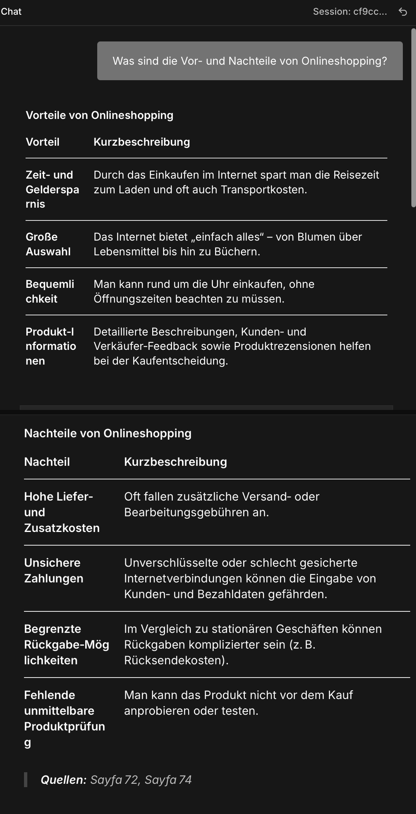

# German Grammar RAG Assistant

A Retrieval-Augmented Generation (RAG) chatbot that answers questions about German grammar (A2 level) strictly from a course book, with page-level source citations, a hallucination guard, and multi-turn conversation memory — built entirely in [n8n](https://n8n.io/) as a visual/low-code workflow.

Live project type: portfolio project demonstrating RAG architecture design, debugging, and evaluation — not just "wiring nodes together."

## Why this project



Most RAG demos stop at "it returns an answer." This project focuses on the parts that actually make a RAG system trustworthy: **can you verify where an answer came from, and does the system admit when it doesn't know something?** Building it surfaced three non-obvious bugs (detailed below) that would have been invisible in a typical demo — each one made the system *look* like it was working while it quietly wasn't.

## Tech stack

| Component | Tool | Why |
|---|---|---|
| Orchestration | n8n (Cloud) | Visual workflow engine, free tier |
| Vector store | Pinecone | Free tier, good LangChain-node support in n8n |
| Embeddings | Google Gemini (`text-embedding-*`) | Free tier, no credit card required |
| LLM | Groq (Llama) | Free tier, very fast inference |
| Source material | *Grammatik Aktiv A1–B1* (German grammar course book), first ~80 pages (Kapitel 10–13) | Personal e-book copy, used only for local ingestion — **not included in this repo** |

All services were deliberately chosen to keep the project runnable on free tiers.

## Architecture

```
Chat Trigger
      │
      ▼
Chat Memory Manager (Get Many Messages) ──► Simple Memory (session buffer)
      │
      ▼
Pinecone Vector Store (Get Many, top-4, metadata included)
      │
      ▼
Code node — formats retrieved chunks as "[Sayfa X] ..." blocks,
            builds a plain-text chat history string
      │
      ▼
Basic LLM Chain (Groq) — System Message enforces:
   • answer only from the given context
   • cite source pages ("Quellen: Sayfa X, Y")
   • say explicitly when something isn't in context
   • treat conversation history as context for *intent*, not as a source of facts
   • critically check that a retrieved chunk is actually on-topic,
     not just lexically similar
      │
      ▼
Chat Memory Manager (Insert Messages) ──► writes the turn back to Simple Memory
```

Why not n8n's built-in Agent/Memory sub-node wiring? The `Basic LLM Chain` node (used here instead of an Agent, since this is a single-tool RAG lookup, not a tool-calling agent) doesn't expose a `Memory` port the way Agent nodes do. Memory is instead managed explicitly with two `Chat Memory Manager` nodes (read before retrieval, write after generation) around a shared `Simple Memory` store — a manual but fully visible alternative to the sub-node wiring.

## What it gets right

- **Source citations.** Every answer ends with `Quellen: Sayfa X, Y` — pointing to the exact page(s) of the book the answer came from.
- **Hallucination refusal.** Out-of-scope questions (general knowledge, chapters outside the indexed range, grammar topics not covered) are declined explicitly instead of answered from the model's own training knowledge.
- **Relevance checking over raw similarity.** The system prefers a *topically correct, lower-scored* chunk over a *lexically coincidental, higher-scored* one (see Bug #2).
- **Multi-turn memory.** Follow-up questions are answered with awareness of the prior exchange, not treated as isolated queries.

## The debugging journey

These three bugs are the most interesting part of this project — each one made the system *look* correct while actually being broken, and each was only caught through evaluation, not by "it compiled."

### Bug 1 — A frozen prompt that always searched for the same thing

The Pinecone node's query field held the literal text `$json.chatInput` instead of the evaluated expression `{{ $json.chatInput }}` — a missing pair of curly braces. Every single question, regardless of content, was embedded and searched as the literal string `"$json.chatInput"`, so retrieval always returned the same four pages.

This was invisible in casual testing because the LLM's own "say so if it's not in context" instruction kept firing correctly whenever the frozen pages didn't match the real question — the system *looked* like it was honestly saying "not in my notes" when it was actually just broken.

**Found by:** comparing the similarity scores returned for two completely different test questions. Two semantically unrelated queries returning a bit-identical top similarity score (`0.556846678`) is statistically close to impossible for genuine embeddings — that was the tell.

**Fix:** wrap the expression in `{{ }}`.

### Bug 2 — A page footer that lexically matched the question

Asking "What's in Kapitel 15?" (a chapter outside the indexed range) returned a confident, detailed — and completely wrong — answer, sourced from a chunk about university cafeteria food. The chunk's text happened to end with a page-footer artifact, `"...KAPITEL 10 15"`, and the embedding model scored it as a strong match purely because the digits "15" appeared in the text, not because the content was actually about chapter 15.

**Fix:** added an explicit relevance-check instruction to the system prompt, telling the model to verify each retrieved chunk is genuinely on-topic before using it, "even if individual words or numbers coincidentally match."

**Result, verified against raw retrieval scores:** for the same question, the system now correctly ignores a higher-scoring but irrelevant chunk (a cafeteria-food passage, score `0.676`) in favor of a lower-scoring but genuinely relevant one — the book's table of contents entry for that chapter (score `0.651`) — and answers from that instead.

### Bug 3 — No Memory port on the chain node

`Basic LLM Chain` has no built-in `Memory` sub-input (unlike n8n's Agent nodes), so a first attempt to wire a memory node directly into it was a dead end. The fix was architectural: manage memory explicitly in the main data flow with `Chat Memory Manager` nodes (`Get Many Messages` / `Insert Messages`) around a `Simple Memory` store, and inject the formatted history into the prompt by hand via the Code node — rather than relying on an automatic sub-node connection that this node type doesn't support.

## Evaluation

A structured 14-question test set (`test-cases.md`, included in this repo) covers five categories:

1. **Basic single-page questions** — does retrieval find the right chunk?
2. **Multi-page synthesis** — can it combine information from several retrieved chunks?
3. **Out-of-scope / hallucination checks** — does it correctly refuse to answer from outside the indexed book, or from general knowledge?
4. **Robustness to phrasing** — same question in Turkish, English, and as a fragmented keyword query.
5. **Edge cases** — empty input, an impossibly broad request ("summarize the whole book" against a top-4 retrieval limit).

Each answer is checked against three criteria: accuracy against the source, correct/honest citation, and — for the hallucination category — whether the system admits what it doesn't know rather than guessing.

## Known limitations

- **Retrieval is not history-aware.** The vector search only embeds the current message, not the conversation so far. A short follow-up like "what about delivery?" is searched on its own, with no guarantee the retrieved pages relate to the earlier topic. This happened to work out in testing (the retrieved "delivery problem" pages were genuinely relevant), but it's a result of the source material's content, not a guarantee the architecture provides. A proper fix would reformulate the query using the conversation history before it reaches the vector store.
- **Top-K is fixed at 4.** Broad requests ("summarize everything in the book") are answered only from whatever four chunks happen to be retrieved, not the full source.
- Ingestion is scoped to the first ~80 pages of the book (free-tier embedding rate limits); the rest of the book is not indexed.

## Setup

1. n8n Cloud (or self-hosted) instance.
2. Credentials: Pinecone API key, Google Gemini API key, Groq API key.
3. A Pinecone index populated with the book's content, chunked with page-number metadata (`page` field) and a `source` field.
4. Import `workflow.json` into n8n, attach your credentials to the corresponding nodes, activate the workflow.

## Repo contents

- `workflow.json` — the exported n8n workflow (no credentials included).
- `test-cases.md` — the 14-question evaluation set.
- `README.md` — this file.
